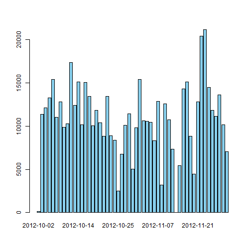
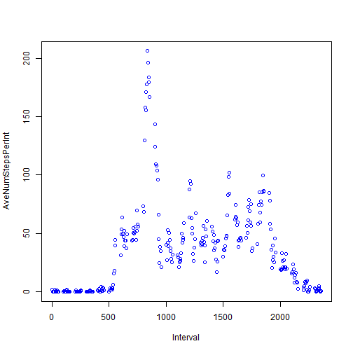
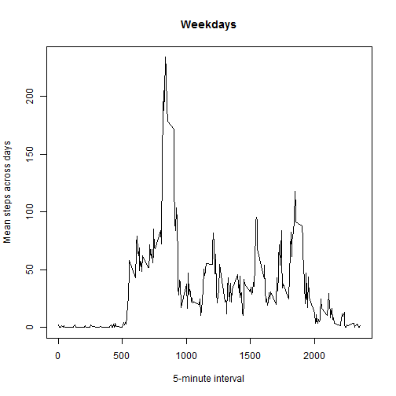
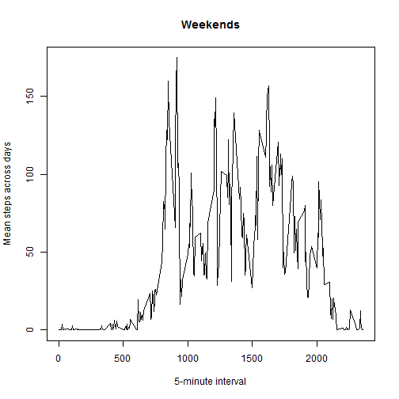

# This is my work in Assessment 1
========================================================

## Loading and preprocessing the data

```r
ActData <- read.csv("activity.csv")
```


## What is mean total number of steps taken per day?

#### 1. The total number of steps taken each day

```r
sdata <- aggregate(ActData$steps ~ActData$date, FUN = sum)
Yn <- as.numeric(unlist(sdata[2]))
Xd <- unlist(sdata[1])
barplot(Yn, width = 1, names.arg = Xd, col = "Sky Blue")
```

 


#### 2.The mean and median total number of steps taken per day

```r
a <- mean(Yn)
b <- median(Yn)
```
The mean total number of steps taken per day: 1.0766 &times; 10<sup>4</sup>  

The median total number of steps taken per day: 1.0765 &times; 10<sup>4</sup>


## What is the average daily activity pattern?

#### 1.Make a time series plot (i.e. type = "l") of the 5-minute interval (x-axis) and the average number of steps taken, averaged across all days (y-axis)

```r
sdata2 <- aggregate(ActData$steps ~ActData$interval, FUN = mean)
Y <- unlist(sdata2[2])
X <- unlist(sdata2[1])

plot(X, Y, 
     xlab = "Interval", 
     ylab = "AveNumStepsPerInt", 
     col = "Blue")
```

 
#### 2.Which 5-minute interval, on average across all the days in the dataset, contains the maximum number of steps?

```r
ans1 <- ActData$steps[which.max(ActData$steps)]
```

It is 806.  


## Imputing missing values

#### 1.Calculate and report the total number of missing values in the dataset (i.e. the total number of rows with NAs)


```r
Numofna <- sum(is.na(ActData$steps))
```
The total number is 2304  


#### 2.Devise a strategy for filling in all of the missing values in the dataset. The strategy does not need to be sophisticated. For example, you could use the mean/median for that day, or the mean for that 5-minute interval, etc.  
  
#### 3.Create a new dataset that is equal to the original dataset but with the missing data filled in.

I will use the mean for that 5-minute interval.

```r
ActData2 <- AcData
xy <- data.frame(X, Y)
subscript <- which(is.na(ActData$steps))
length(subscript)
i=1
for(i in 1:length(subscript))
  {    sub <- xy$Y[xy$X == ActData$interval[subscript[i]]]
       ActData2$steps[subscript[i]] <- sub
  }
```
ActData2 is the new dataset.  


#### 4.Make a histogram of the total number of steps taken each day and Calculate and report the mean and median total number of steps taken per day. Do these values differ from the estimates from the first part of the assignment? What is the impact of imputing missing data on the estimates of the total daily number of steps?

```r
sdata3 <- aggregate(ActData$steps ~ActData$date, FUN = sum)
Yn1 <- as.numeric(unlist(sdata3[2]))
Xd1 <- unlist(sdata3[1])
barplot(Yn1, width = 1, names.arg = Xd1, col = "Sky Blue")
```

 

```r
a <- mean(Yn)
b <- median(Yn)
```
The mean total number of steps taken per day: 1.0766 &times; 10<sup>4</sup>  

The median total number of steps taken per day: 1.0765 &times; 10<sup>4</sup>


So, we can conclued that if we fill the Na by mean for the day, we will did't change anything in analizing by day, but will change the value by interval. And, if we fill the Na by median, the numeber will change a lot expect the median number ananlized by day.

## Are there differences in activity patterns between weekdays and weekends?


```r
ActData2 <- read.csv("activity.csv")
ActData2$date <- weekdays(as.Date(ActData2$date)) %in% c("星期六","星期日")
#when you text the Rmd file, please use "Staurday" to replace "星期六", and "Sunday" to replace "星期日"
wd <- subset(ActData2, ActData2$date == FALSE)
we <- subset(ActData2, ActData2$date == TRUE)
a.we <- aggregate(steps ~ interval, data=we, FUN=mean)
a.wd <- aggregate(steps ~ interval, data=wd, FUN=mean)
plot(a.wd$interval,
     a.wd$steps,
     type="l",
     xlab="5-minute interval",
     ylab="Mean steps across days",
     main="Weekdays")
```

 

```r
plot(a.we$interval,
     a.we$steps,
     type="l",
     xlab="5-minute interval",
     ylab="Mean steps across days",
     main="Weekends")
```

 


There has a little difference that the process is more smooth during the weekends.
